# Game Design Document

  
`A L P H A // C O M M I T`

### General information
**Team name:** “Alpha Commit”  
**Team members:** Baratto Diego (919538), Costella Alessandro (920031), Liggio Giorgio Maria (905471)

---

## 1. Changelog
| Author        | Date          | Description |
| ------------- | ------------- | ----- |
| Costella Alessandro | 2019-04-15 | Added logline |
| Costella Alessandro | 2019-04-15 | Added last interfaces |
| Costella Alessandro | 2019-04-15 | Added main menu, shop, cards and in-game interfaces |
| Costella Alessandro | 2019-04-15 | Added game modes |
| Costella Alessandro | 2019-04-15 | Added assets list |
| Costella Alessandro | 2019-04-15 | Added card rules and level RCG |
| Costella Alessandro | 2019-04-15 | Added rules, wincons, controls, flowchart |
| Baratto Diego | 2019-04-15 | Updated project subdivision |
| Costella Alessandro | 2019-04-12 | Added Gameplay 5.1 and 5.2 |
| Costella Alessandro | 2019-04-12 | Added character design, removed Game World |
| Baratto Diego | 2019-04-11 | Fixed image issue |
| Baratto Diego | 2019-04-11 | Inserted image into document |
| Costella Alessandro | 2019-04-03 | Audience chapter complete, removed Legal Analysis. |
| Costella Alessandro | 2019-04-03 | Vision Statement  |
| Liggio Giorgio | 2019-04-03 | Push first game design writing |

## 2. Vision Statement
*Sunday Knights: Magic & Mayhem* is a marriage of *Candy Crush* + *Clash Royale*. It's a fast puzzle game where two opponents play against each other. The game setting is a medieval fantasy world with various locations. The game will feel partly serious and exuberant. In each game, the player will face an AI opponent or a real-life user in multiplayer mode. There are game modifiers that come in the form of playing cards, to gain points more quickly or slow down the opponent.

There's huge emphasis on the multiplayer game pacing, with head-to-head fast matches where anything can happen due to special actions. Many in-game rewards such as game cards, resources, and currency are designed to convey a sense of accomplishment and achievement.

### 2.1. Game Logline
*“Embark on a journey to fight back the forces of evil, one puzzle at a time.”*

### 2.2. Gameplay Synopsis

#### 2.2.1. Uniqueness
*Sunday Knights: Magic & Mayhem* is a Match 3 game featuring fast-paced action and CCG (Collectible Card Game) elements. It stands out from other titles in the category because it combines puzzle games with a 1v1 player-vs-player experience; as a matter of fact, the design focuses on the long-term engagement of users thanks to the social gaming aspect.

#### 2.2.2. Functioning & Core Mechanics
> This section is intentionally descriptive. For further information and implementation details, please refer to Chapter 4 ("*Gameplay*") of this document.

The fight between Good and Evil takes place on a square grid filled with tiles in the form of coloured gemstones. Although winning conditions may vary, the core mechanics stay the same across all game modes.

The game goal is to gain points and resources by clearing tiles from the game grid. Players can swap tiles with nearby ones; when a group of tiles satisfies the matching rules, they are removed from the grid. Finally, remaining tiles fall downwards, and new tiles spawn from the top of the grid columns.

Combined ("combos") and cascade matches award more points. Certain tiles can behave differently, like matching with any colour or performing special actions.

Players can also perform special actions by consuming an action card; these produce the same effects activated by special tiles, but they can be invoked at any time.

Players face some constraints while playing, depending on the game mode. There may be a maximum number of moves or a time limit before the game is over.

As non-exhaustive, non-final examples, we can estimate the following values:

* Single player game, easy difficulty
  * Move limit: **15 to 25 moves**
  * Time limit: **no limit**
  * Card limit: **4 cards**
* Multiplayer game
  * Move limit: **30 moves**
  * Time limit: **2 minutes**
  * Card limit: **4 cards**

#### 2.2.3. Setting
The game takes place in an archetypical medieval fantasy era, in the peaceful Kingdom of Ludenia. The first impression the player gets is one of peace and carefreeness since Ludenians are happy and cheery people. Ludenia has many views to offer; beautiful landscapes hold majestic castles and quiet villages, the woods are home to many animals, and the mountains contrast a sea stretching as far as the eye can see.

Things change when the story antagonists show up. The Dreary Army is driven only by the need for stealing everyone's happiness, and this reflects in a duller mood in the environments. Wherever they go, life withers and joy disappears, nature recedes, and desolation overcomes everything.

A hero must save the realm from becoming another wasteland.

#### 2.2.4. Look and Feel

## 3. Audience, Platform, and Marketing
Audience analysis and definition is based on, but is not limited to, the core demographics of leading titles in the genre; other factors such as business objectives and mobile market tendencies were also considered.

> The following paragraphs are about the game audience. For a more comprehensive comparison with other competitors, please refer to paragraphs 3.3 ("*Top Performers*") and 3.4 ("*Feature Comparison*") of this chapter.

### 3.1. Market Insights
Puzzle games have no well-defined target audience, due to the high flexibility of both gameplay and cosmetic elements; this means that marketing choices, such as defining a target audience, heavily influence their core design.

A user analysis by Newzoo [1] on King's *Candy Crush*, a top performer on both Google Play and Apple Store, shows that the actual player base is broader than the intended audience: although King's core demographic is mostly women, a significant portion of players (40%) are male. In particular, *Candy Crush* appeals to a demographic with 42% of players between the age of 21-35 and almost 40% above 35.

The same analysis also highlights some features of Supercell's *Clash of Clans* core players: they are predominantly male (77%), and over half of them fall into the 21-35 age category with only 23% of players over the age of 35. We account for these insights due to the presence of fast-action elements in our game, considered in titles not belonging to the classic puzzle game genre.

Finally, most *Candy Crush* players enjoy the game on mobile devices, and define themselves as "casual gamers" (45%); they mainly play games to pass the time and don’t invest a lot of money in them. On the other hand, *Clash of Clans* players are at least "mid-core", playing games on a regular basis and being also open to try different type of games (16%) such as a puzzle game.

Of *Candy Crush Saga*’s players, males (54%), are more likely to pay for mobile games.

Comparing *Clash of Clans* with its younger brother *Clash Royale* [2], it shows the player base is virtually the same with small variations of the statistical values. Then, previous considerations are still valid when considering similar titles for comparison purposes, and not restricted to the *Candy Crush Saga* and *Clash Royale* titles only.

[1] ["Supercell vs King: How do Clash of Clans and Candy Crush gamers compare?"](https://newzoo.com/insights/articles/supercell-vs-king-how-do-their-gamers-compare/)  
[2] [SimilarWeb's App Analysis on Clash Royale](https://www.similarweb.com/app/google-play/com.supercell.clashroyale/statistics)

### 3.2 Target Audience
The study shows how the public is diverse among some genres. Age is not a restriction since a large share of users can enjoy the same contents and themes in games; gender is blatantly relevant for similar reasons.

The intended audience for our game consists of adults aged 25-35 (spread ±5), with a part-time or full-time occupation (e.g. job, school). They are casual players and enjoy playing games in their spare time, to take a break from the daily routine, or while travelling. Our target has no specific gender identity; while the core game is suitable to anyone, additional content may be appealing to a particular gender group or subgroup.

### 3.3. Top Performers
Reference categories for this analysis are "Casual" and "Puzzle", as both are suitable for a puzzle game aimed to entertain the average casual gamer.

Top titles in these categories are *Candy Crush Saga*, *Toon Blast*, *Matchington Mansion*, *Farm Heroes Saga*, *Homescapes*, *Gardenscapes*, *Merge Dragons*, only to mention some. They are a paragon of appeal and long-term user engagement; their game experience is addicting and backed by valuable social and monetisation features.

App ranking and audience interest of these games show their tendency to stay in the top charts of mobile marketplaces; trending games may vary during time, but top-grossing and top-selling games hold their positions against minor titles and clones.

### 3.4. Feature Comparison
Previous games share some common features: a background story to motivate players to play more games; balanced endgame rewards to incentivise replays and make backtracking less frustrating; optional in-app purchases and/or lack of in-app advertisement.

The killer feature of *Sunday Knights: Magic & Mayhem* is multiplayer. Although competitors have a single player game mode as well, *SK: M&M* introduces a game mode that put two players one against each other, in a fast-paced puzzle game for getting the higher score.

The only known game to merge puzzle games and multiplayer is *Tumblestone*, featuring up to 4v4 real-time games. The main difference is the core game, for *SK: M&M* is a *farming* tile game (the grid always fills up empty cells), while *Tumblestone* is an *elimination* tile game (a game is over when the grid is empty).

### 3.5. Target Platform
The target platform for the game depends on different factors, the most important of which are the market addressed and the user share one wants to reach out.

Given the game genre and the players' mindset, it's obvious mobile devices are the best option as a gaming platform: casual players want to enjoy a game at any time and in any place, and mobile devices satisfy such requirements. We focus on smartphones and tablet devices, the former of which are widespread.

For *SK: M&M*, we chose the Google Play Store as the launch marketplace of interest; hence, development turns towards Android-powered mobile devices during its early phase. A late iOS port of the game may be considered further if feedback from the Android testing ground results positively.

### 3.6. System Requirements
Taking software constraints into consideration, such as the game engine used, graphical level of detail, or the device coverage, we can estimate the following recommended requirements:

- CPU: **Intel Atom Z2560 Dual Core 1.6 GHz or equivalent**
- GPU: **PowerVR SGX544MP2  or equivalent**
- RAM: **512 MB**
- Storage: **100 MB**
- OS: **Android 4.4**
- Phone: **Samsung Galaxy S3 or equivalent**

It's clear this is a non-demanding app, designed to run on most Android devices. A device that has these or equivalent specs is capable of running the game smoothly.

### 3.7. Business Model
The monetisation strategy adopted for *SK: M&M* focuses on in-app purchases: with 74% of spending in the Google Play Store coming from in-app purchases in previous years, it is no wonder IAPs are an effective mobile game business model. This monetisation strategy also lets developers manage their sales directly, influencing the users' behaviour within the game.

#### 3.7.1. IAPs and Gameplay
The game lets players harvest resources by playing, getting rewards, acquiring items with the in-game currency, or purchasing in-game articles with real money. Players are encouraged to purchase items thanks to their trial-and-error approach to the game: acquiring resources needs time, and this leads to a limited number of games per time unit. Since losing a game rewards the player less than winning, if they want to boost their activity, they can then get more resources instantaneously in the shop screen.

#### 3.7.2. Release Strategy
The release plan for the game is a soft launch with two main phases: closed and open beta.

Once the main features are defined, the closed beta rolls out for a chosen group of users. During this phase, data and feedback are gathered to fix current builds, balance gameplay, and evaluate design choices. Contents can be added, changed, or even removed during this phase, as this is the first test playground.

The second phase is the open beta: the game is publicly downloadable by anyone but is still undergoing improvements and updates. Contents are more stable, yet they can further improve and change until the first stable version comes out.

This release strategy let developers improve the whole software system in a gradual and controlled manner, and collect continuous feedback from the community about both application stability and game contents.

## 4. Gameplay

### 4.1. Overview
The game is about matching groups of 3 or more faces on a grid by swapping couples of them. Only adjacent faces can be swapped, vertically or horizontally. Furthermore, the game includes playable cards that can change the state of the game for the player or their opponent.

### 4.2. Gameplay description

#### 4.2.1. Mechanics

##### Faces
The game is about making faces disappear ("freeing" them from the evil curse) by matching groups of them. The main part of the in-match GUI consists of a grid of 6x7 faces of random colours (6 columns x 7 rows), as is described in further detail in the Interfaces section. The player can swap couples of adjacent faces by "spending" a move - meaning their move count diminishes by one for each swap they perform. A swap is EFFECTIVE only if it actually "groups" 3 or more faces of the same colour, meaning if a swap doesn't cause any face to disappear, it is automatically reverted by the game. In this case, the move is not spent.

##### Moves
Every player starts the match with a set number of moves and cannot usually gain any (some cards cause exceptions to this rule). PvP matches grant 30 starting moves, campaign scenarios grant a different number of moves based on the single level.

##### Score
Each time faces disappear, they grant score based on the size of the group of faces matched. 3-faces matches grant 30 points, 4-faces grant 60, 5-faces grant 100, 7-faces grant 300

##### Score Threshold
Each level has a minimum score the player must reach in order to achieve victory. This number varies throughout the campaign, while in PvP matches it's a fixed 1200.

##### Cards
Cards are items the player can use at the expense of moves, with the cost depending on the single card. The player can unlock them by playing the campaign or by buying packs with coins they gain through PvP matches. Cards are either blue, if they provide a bonus or help for the player, or red, if they damage the opponent. Cards are played by tapping on them.

###### Card List

This section only includes the cards that have been design for the prototype. The final version of the game will include many more. These cards all have the same level of rarity, meaning each card in a pack has a chance of 12.5% to be each of them.

> Blue cards

1. It's raining men!

The It's raining men! card provides a way to change the colour of the user's board side faces. For 5 seconds after activation, small stars of random colours among the five faces' colours will fall, one per second. By dragging and dropping those stars on a face, the player will make that face's colour change into that of the star.

2. Go Go Go!

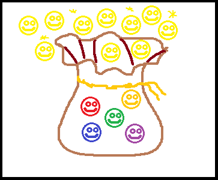

The Go Go Go! card allows the user to gain extra moves. Upon activation, all faces will star shining slightly in their colour. The player will then have to perform a match. After the match and comboes caused by it end, the player will gain a number of extra moves equal to the combo counter they achieved.

3. Da Bath Bomb!

The Da Bath Bomb! card requires the player to target a specific face cell. Upon targeting, the card will "demolish" the selected face (by making it happy, of course) and the 8 faces in the square around it, in an explosion of soap foam. This will grant the player 150 points. The card is consumed upon resolving. If the opponent casts a red card during the "aiming" phase, the Bath Bomb effect doesn't take place and the card is not consumed. The player will have a chance to play it again after they get rid of any red card effects.

4. Gimme that juice!

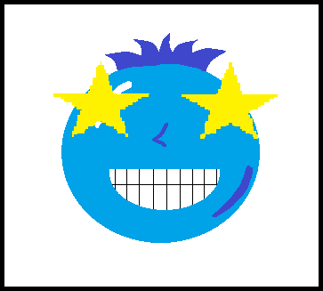

The Gimme that juice! card covers all the faces in sparkly raspberry juice, making it so they provide double points for 5 seconds.

>Blue cards interactions

Any number of different blue cards can be active at the same time. This means a player can, for example, activate a "Go Go Go!" card, set up a "Gimme that juice!" for extra points, then hit super hard with a "Bath Bomb" or a "It's reining men!" and gain a good number of extra moves and a huge score boost. No two same cards can be active at a time. This applies to all blue cards except Bath Bomb, that does not have any over time effect.

>Red cards

1. Who wants pie?

The Who wants pie? card throws - surprisingly - a pie to the opponent. Upon activation, the opponent will see it come towards them - by becoming bigger and bigger - out of the user's screen, in their top right corner. Upon impact, the pie will cover the victim's screen in cream, leaving 4 pink spots around the screen that will need to be rubbed away, and leaving 15 faces - chosen at random - covered in pink cream untill they are moved once. Cream will cover those faces completely, making it impossible to see what colour they are. "Being moved" means they either get successfully swapped or they fall due to a match on a lower row.

2. Isn't it time?

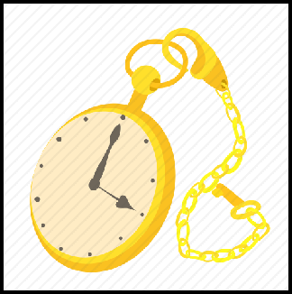

The Isn't it time? card "stop" the time for the user's opponent's board, without stopping the game timer. The opponent will see a series of 12 numbered buttons, representing hours, appear in sparse order around their screen. To remove the effect, the 12 numbers must be tapped in order. Every time the victim taps on the lowest number still present, that number will disappear. Once the 12 is gone, the victim's game will resume.

3. Did you say ice?

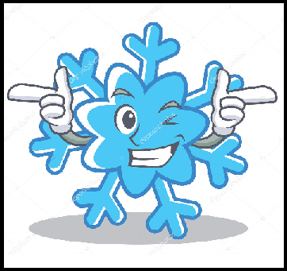

The Did you say ice? card shatters the opponent's screen. Not for real, that is. Upon use, the opponents screen will creak like ice under weight, then the center of it (a circlish portion as wide as the board) will shatter into 5 pieces. The victim will have to put the pieces back into place in order to resume their game. Each piece, after being placed in it's place, will stay there for 3 seconds, then will tremble for 2 seconds, then, if the puzzle hasn't been solved, will fall again.

4. You jellous?

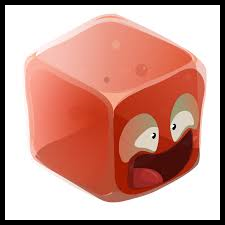

The You jellous? card makes the opponent really jellous. Upon activation, a big red jelly will cover the top 3 rows of the opponent's board. If a face is engulfed in jelly, it will move and swap at 1/5 of it's natural velocity. To make the jelly burst and disappear, the victim will have to perform 3 matches (combos count) inside it, with it meaning at least 1 face of the match needs to be in it.

>Red cards interactions

At any time, only ONE red card can be active for each player. This means a player cannot activate a red card as long as their opponent is still under the effect of the previous red card.

>Red and Blue cards interactions

The "Isn't it time?" card, "Did you say ice?" card and the first phase of the "Who wants pie?" card - the one when the opponent needs to swipe the cream away - are TIME FREEZING effects. This means that they "pause" the effect of the enemy's blue cards, if any are in effect when the red card is played. As for the rest, pie cream and jelly do not stop time, and thus work alongside any enemy blue card, effectively slowing them down. They are meant to be good counters to big combos, by, for example, making the opponent waste their precious 5 seconds of score boost.

###### Coins
After every PvP match, the player will be granted coins: 15 if they win, 5 if they lose. Coins can be gained either this way or through spending real money. They can only be "lost" by buying packs. Cards can be either common or rare.
	Card example: Bomb

##### Packs
There are 2 card packs that can be bought in the Shop (see Interfaces for the Shop), one providing 1 card for 100 coins and one providing 3 cards for 250 coins. Cards are randomized based on their rarity: each card has 95% of being common and 5% of being rare.

##### Friends
Player can add friends to their Friend List. They can do so in 2 ways: by adding their last opponent or by searching for a user by nickname. Both these options can be found at the bottom of the Friend List Interface. There are 2 ways a player can interact with a friend:
By chatting through a simple, transparent pop up at the bottom left of the screen
By dueling.
In case a player challenges another, the other player will see a "Challenge pop-up" appear, and they can decide if to accept or refuse. If they accept, both players will be sent to the "Card selection" interface and, once both have pressed the "READY!" button, the match will start. The first of the two players to press "READY!" - or both in case the game takes time to load - will see the button greyed out.

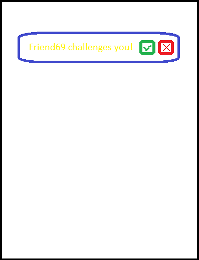

### 4.3. Controls
The game is controlled through the phone's touch screen.

**Choosing the cards before a game:** tapping a card on the grid will move it into the "selected cards" area. Tapping on it in the selected cards area will move it back into the grid.

**Swapping:** swapping 2 faces is done by "dragging" one in a particular direction, either vertical or horizontal. The first point of pressure pinpoints the face to move, moving the finger towards another face selects it as the second one to swap.

**Using non-targeting cards:** a card can be used by double tapping on it. The first tap will highlight the card, while the second will "confirm" the selection and activate the effect. Tapping anywhere else after the first tap will cancel the card selection.

**Using targeting cards:** a card that needs to target a cell can be activated by tapping on it once. An arrow will appear from it towards the center of the board. The second tap, that is to be performed on a face, will activate the effects on the selected face. Tapping outside of the board will cancel the card selection.

#### 4.3.1. Interfaces
For all interfaces, the phone is considered to be in portrait mode, vertically held.

##### Main Menu
The main screen features the necessary buttons, the details of which will be further described in the assets section, on a static background. The buttons are, as they appear from top to bottom:

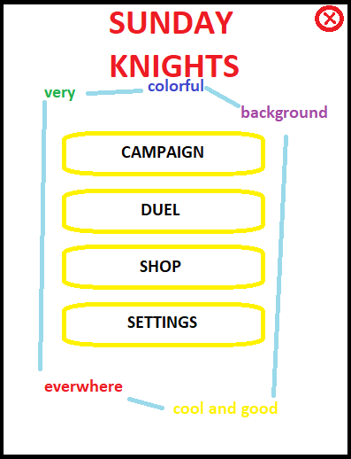

The main menu screen will also feature a red X button to quit the game on the top right side of the screen.

##### Shop Screen
The shop will feature Robin on the bottom left of the screen, filling the whole bottom part with a conversazion balloon containing "Hey! Nothing better than some new gear to go into battle again!". Above him the screen will show 3 different kinds of card packs, with their pricing and the "buy" button with only the packs prices on it.

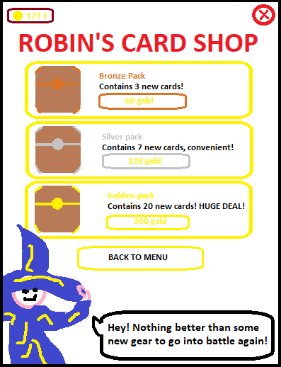

The top left corner shows a little insertion with the player's money account, with a small "+" button on the side. Tapping on the money or the + will open the "buy coins with real money" pop-up. The exchange rate is €1 - 100 gold, with bigger bundles to be decided upon.

##### Card Selection
The card selection pop-up appears before queuing for a game or going into a campaign level, allowing the player to select four cards to play in their game. It holds a square grid of all the cards the player owns on the top, the square's side being half of the screen's height, and a bottom section of 4 slots to see what cards have been chosen so far. This screen can be quit by tapping anywhere outside the card selection pop-up, going thus back to the main menu screen from Duel mode or to the Level Selection in Campaign mode.

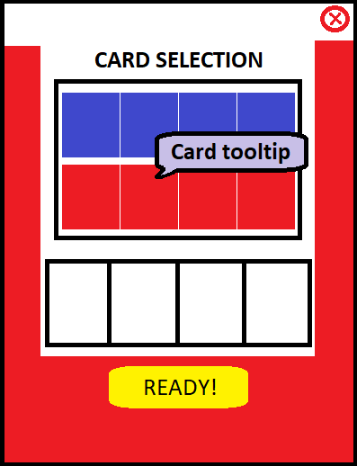

The card selection pop-up also features cards' brief descriptions. A small button in the shape of a question mark is placed on the top-right corner of the pop-up, to visualize those tooltips. The tips will appear in the form of comic baloons coming out of the cards' icons. The tooltips are as follows.

1. It's raining men!: mix colours at will
2. Go Go Go!: perform combos to gain moves
3. Da Bath Bomb!: bursting happiness!
4. Gimme that juice!: moves grants more points
5. Who wants pie?: throw a cake at your opponent
6. Isn't it time?: time out your opponent
7. Did you say ice?: breaks your opponent board
8. You jellous?: cover your opponent in jelly

A big yellow "READY!" button allows the player to declare they are ready to go into the game.

##### In-Game UI
The in-game interface looks as the look-and-feel section shows. In addition to those elements, the "ME" and "OPPO" sections feature a small bar on the bottom of their respective squares that empties to the left in 30 seconds, resetting everytime the assigned player makes a move. That bar is the inactivity bar, that makes the player lose the game if it empties completely. There is also a main time bar, showing how much time is left, below the 2 squares, just as broad as the 2 squares together.

##### Settings Menu
The settings menu has the same look of the main menu. The background and X button stay the same, while the menu button change into:

Music and Sound effects button, if tapped, will grey out and turn music or sound effects off. If tapped on again, the effect will be reverted.
The Credits button, if tapped, will show our team's and respective names - yay!

##### Score Screen
When the game ends, both players will see the score section of the screen move to the screen center in 1 second, while the rest of the screen gets shadowed. Once this is done, the highest of the 2 scores will start shining and be moved in the center of the screen, blue if it's the current player's, red if it's their opponent's.

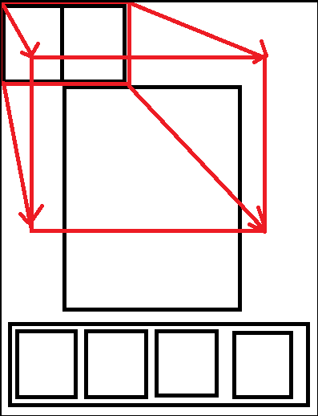

At that point, the sentence "You win!" or "You lose!" will appear, depending on the situation, and the Victory Fanfare or the Defeat Riff will sound. A button with the word "continue" will appear just under "You Win/Lose" to return to the main menu.

##### Level Selection
The campaign level selection screen features a "path" connecting the levels, which are represented with buttons with their numbers above them. The background shows the land of Ludenia.
All completed levels will appear as blue, smiling faces, the next level to complete will appear as a sad, red face. Unlocked levels will appear as sad, stone-grey faces.

##### Friend List
The main menu, shop screen, setting menu and level selection interfaces also feature a Friends button. It is used to visualize the friend list, which is used to start a chat or a match with any user added to it, provided they are not in game.

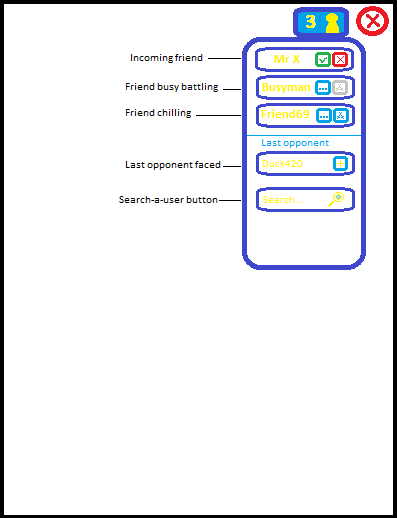

#### 4.3.2. Rules
The number of possible moves is set for each game. Time is set only in multiplayer games.

It is not possible to swap 2 faces if this does not cause any match to happen. The swap will be reversed and the move will not be spent.

A PvP match can result in a player's victory or a draw. A draw happens if both players hit the same score or if no player can reach the score threshold.

The player has to make at least one move every 30 seconds. Otherwise, victory will be granted to the opponent due to inactivity. If this happens, it will not be possible for the inactive player to join a game for 3 minutes.

The card the player can use are to be selected through an ad-hoc screen before entering the game (or level). The same card cannot be used again without making 10  9 other moves first.

If a player disconnects from the game more than 30 seconds from the end, their time will deplete naturally and they will lose the game. If a player disconnects during the last 30 seconds, the will just result inactive for that last part of the match, with no mechanical consequences. The winner will be computed regularly.

#### 4.3.3. Scoring/winning conditions
Campaign: the level is won if the player can achieve a level-depending score withing the given number of moves.

PvP: the player who, having reached the threshold, reaches the highest score, wins the game. Alternatively, if a player does not make a move for 30 seconds straight, their opponent wins the game.

### 4.4. Game Modes and Other Features
**Campaign:** a series of levels to be played in a sequence. A level cannot be accessed if the previous one has not been defeated. The campaign is a single player mode of 30 different levels, with different mechanics emerging with higher levels. This mode awards coins and cards with the rules described above. In this mode, griefing cards (the ones that hinder the opponent's gameplay) are not usable.

**PvP:** the core of the game. This mode consists of 1v1 matches, not longer than 3 minutes. In this mode, all cards are allowed. This mode rewards coins as described above.

### 4.5. Levels
Levels are generated through an Random Content Generation algorithm, with due restrictions (for example on the number of face colours present in the level) based on their "position" in the campaign.

### 4.6. Flowchart

## 5. Game Characters

### 5.1. Character Design

##### Zeely
The player's guide is a trust-inspiring, colorful little parrot. It has a yellow body, red chest and light blue underwings and head, and green eyes. He is always cheerful and full of energy, never appearing without smiling eyes. The anatomy is a standard Forpus' parrot one.

##### Robin
The shop-keeper is a short boy, wearing robes a bit too big for him, but not so much to make him look goofy. He has short, brown hair, big blue eyes and a big pair of round glasses on them. His clothes are mostly Risultati immagini per blue color 2661F7 blue, with ocra yellow adornments on the edges. As an apprentice wizard, he also wears a big blue pointy hat of the same making, so big he has to keep a hand on it to prevent it from falling. Just like Zeely, he is always cheerful, presenting himself with an open smile every time he appears.

All the characters described above are NPC. They only appear to tell the player something, or to adobe the shop's screen. They have hence no A.I.

## 6. Media List

>Faces

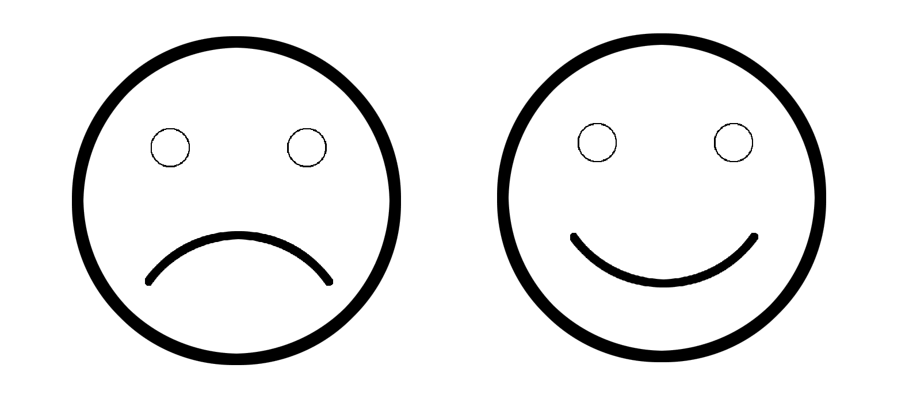

Faces apppear in 5 different colours: red (E00201), green (rgb 10, 255, 60), yellow (FFFF33), violet (710193) and blue (0038a8). As seen in the example above, they have 2 stages, a sad one before being matched, and a happy one after being matched.

>Faces animation

Faces have a specific animation when they get matched, turning their frown into a smile in 0.5 seconds and then popping away towards their center. This is accompanied by a "pop" sound.

>Cards animations

1. It's raining men!

Upon activation, from the very top of the screen, one star per second will start falling for 5 seconds. The horizontal coordinate of each star is random. Each star is of one of the faces' colours, and the colours order is random. The stars take 5 seconds to traverse the whole screen, disappearing by leaving it at the bottom.

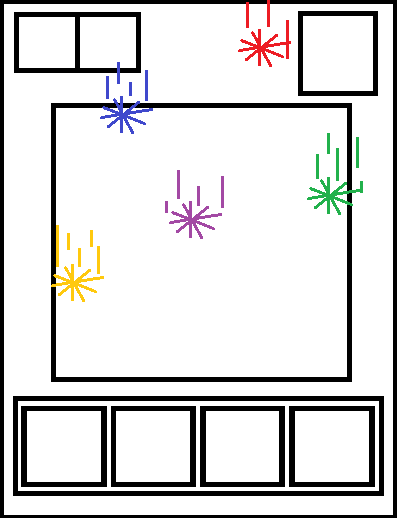

Each star can be drag-and-dropped on a face, thus disappearing and changing that face's colour.

2. Go go go!

As in the card's description, upon activation and for the whole duration of the card, the faces will slightly shine in their colour, becoming brighter. After the effect ends, a big red "+X MOVES!" will appear in the center of the screen for one second, before flying towards the moves counter while becoming small and disappearing in it, as the counter is increased by X.

3. The Bath Bomb!

Once tapped, the card will shadow the screen a bit and make a red arrow appear from itself, pointing outside the board on the left if the card's on the left, on the right otherwise.

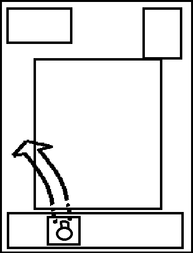

Upon a tapping on a face, the arrow will follow the finger and the effect will activate, "exploding" the face and the 8 faces in a square around it in foam, making them happy and hence making them disappear.

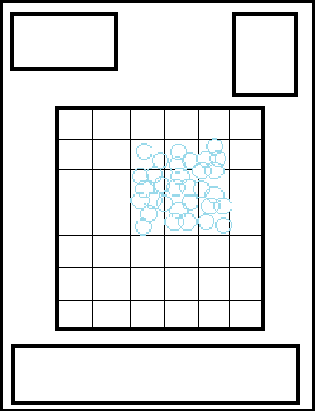

4. Gimme that juice!

Upon activation, a whole lot of juice will be sprayed on the user's screen, covering it for a second.

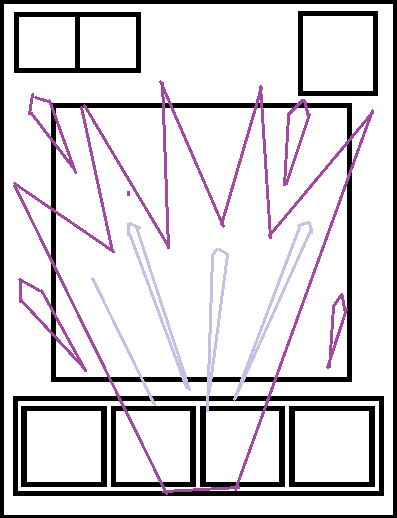

Once that is over, all faces will be dirty of juice in the top part for the duration of the effect. When it depletes, the juice will simply fade away in 1 second and let the faces return to normal.

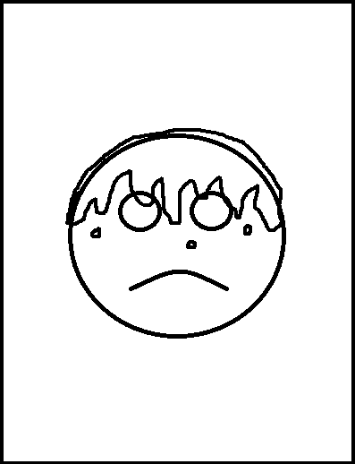

5. Who wants pie?

Upon activation, the opponent will see it come towards them - by becoming bigger and bigger - out of the user's screen, in their top right corner.

Upon impact, the pie will cover the victim's screen in cream, leaving 4 pink spots around the screen that will need to be rubbed away, and leaving 15 faces - chosen at random - covered in pink cream untill they are moved once.

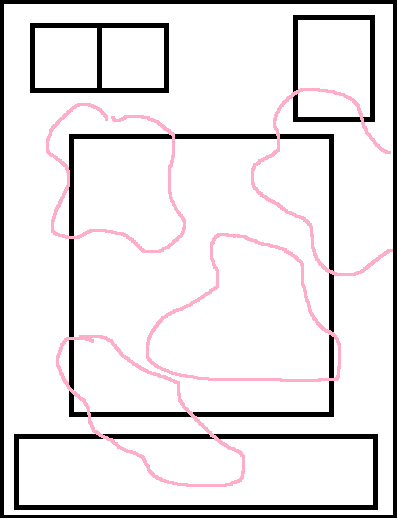

The cream spots will simply disappeared once rubbed once.

6. Isn't it time?

As soon as the card is activated, the opponent's screen will be shadowed with a light blue filter. At the same time, 12 hour buttons will appear in random spots throughout the victim's screen.

The hour buttons will gently float in place, hovering untill they are tapped. Once the last one is tapped, the screen filter will disappear and the game resume.

7. Did you say ice?

The Did you say ice? card will cause the center of the enemy's screen to shatter. The enemy will see a circa-round portion of their screen start creaking like ice over 3 seconds, then the pieces will explode and fall down.

8. You jellous?

Upon activation, the victim will see a jelly grow from the center of their second row, expanding in 1 second untill it's engulfed the first 3 rows of their board. If the victim touches the engulfed area, all that will happen is the jelly swaying and making a "blob" sound.

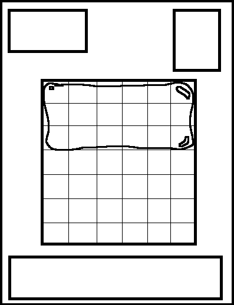

Once the right conditions are met, the jelly will shatter in little pieces that will swiftly shrink into nothingness.

>Card packs

Despite being of 3 different types, card packs all work in the same way. Once the player presses the "X GOLD" button in the dedicated shop section - with X being the price of the pack, see SHOP'S SCREEN - the pack will be move to the center of the screen, shadowing the rest of the shop. Robin's baloon will then change into "BRONZE/SILVER/GOLDEN PACK! GREAT CHOICE!" with the right selection between bronze, silver and colour. The pack will then burst open, with the explosion being the same colour as the pack's "level", so either bronze, silver or golden. After that, where the pack was untill a second earlier, a stack of card will be visible. By clicking on it, the player will be able to pop it from the pile and see the following one. From immediately after the burst, Robin's baloon will change again, into "Here are your new cards!". If the player does not tap on the screen for one second, the card's tooltip will appear as a balloon beside it. For tooltips' content, see cards description. As soon as all the cards have been popped away, Robin's baloon will return to the original shop one.

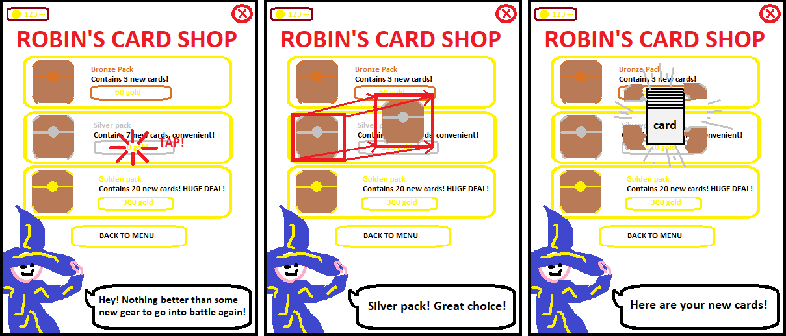

*	Menu music
*	In-game music
*	Match-3 sound effect
*	Victory fanfare

>Defeat riff

This is what the player heards upon defeat. It's a riff of 4 notes, on descending demitones, from Bb (or Sib) to G (or Sol), with a long tremble on the last one.
